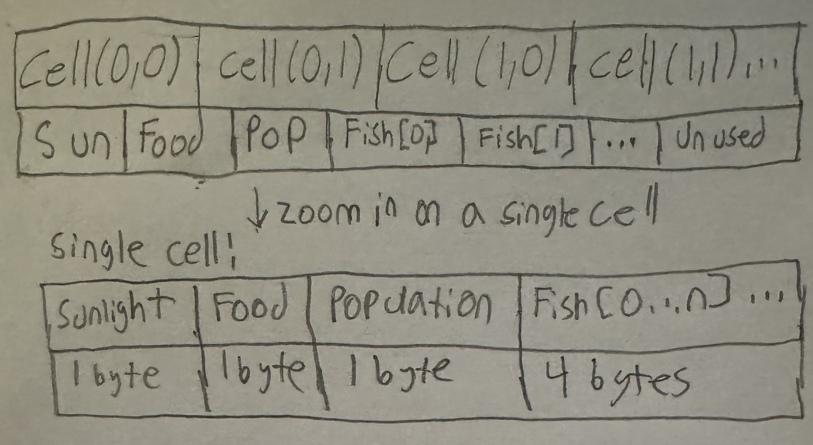

# CMPM-121-Final

# Devlog Entry - 11/13/24
## Introducing the team
- Tools Lead: Enrique Paz
- Engine Lead: Raul Mojarro
- Design Lead: Lyle Watkins

## Tools and materials
We are going to be using TypeScript and the baseline web platform because they are things we have been using and are familiar to us right now. We will be using VSCode for our IDE because it’s easy to use and we are most familiar with it. Lyle will use Procreate to create visual assets because it has a built-in animation editor and they have been using it for years. Our alternate platform choice is PixiJS and we chose it because we don't like Phaser and want to try something new.

## Outlook
One thing we anticipate being a hard part of the project is setting up our game visually while using HTML. Also, another thing we anticipate being hard/risky is having our game break during the switch if there is one. We are hoping to learn how to use our alternate platform PixiJS and also learn how to create a game without an engine.

## Devlog Entry - F0
## How we satisfied the software requirements
### You control a character moving over a 2D grid.
This was fairly easy to implement for our group. We created our game world by placing each square within a 2D array. The player movement code adjusts the player positon by adding/subtracting 1 from a player's coordinates(col and row), which corresponds to a square within the array. If the player would go out of bounds, then they aren't moved.

### You advance time manually in the turn-based simulation.
For our game, we currently have it so that time will only advance if the player presses the **Next Day** button, which calls the NextDay function. Within this function, we call several functions that control each component of the game that should be updated with the passage of time: the amount of food produced in a cell based on the amount of sunlight, having the fish population consume the food and improve each fish's growth if they were able to get food, having the population increase if they are enough in a cell, and then generating the new sunglight amount for each cell.

### You can reap or sow plants on grid cells only when you are near them.
When the player is on a cell, they can purchase a fish to place in that cell by clicking on a button from the shop on the right of the screen. If a player clicks on a cell, the player will be moved to that cell and a popup appears that allows them to sell fish from that cell. 

### Grid cells have sun and water levels. The incoming sun and water for each cell is somehow randomly generated each turn. Sun energy cannot be stored in a cell (it is used immediately or lost) while water moisture can be slowly accumulated over several turns.
For our game, we swapped out water for food as a resource. The sunlight value of each cell is between 1 and 10, and it has a random chance of being increased or decreased with each day. Food is stored in each cell, which is also capped at 10. Each day, if it is below that threshold, then it will generate more food proportional to the sunlight level of the cell. Food is not decreased unless there are fish in the cell, in which food will decrease for each fish fed. 

### Each plant on the grid has a distinct type (e.g. one of 3 species) and a growth level (e.g. “level 1”, “level 2”, “level 3”).
We currently have three different fish types, simply catergorized as Green, Yellow, and Red. Each fish has a food level, a growth level, and a  value. Depending on their type, they have a different cost, growth multiplier, and amount of value they can gain every growth level.

### Simple spatial rules govern plant growth based on sun, water, and nearby plants (growth is unlocked by satisfying conditions).
The amount of sunlight in a cell will determine how much food is regenerated at the end of a day, which will then be consumed by each fish in the cell. If there are at least two fish, there is a chance they will reproduce. A fish's food level increases by 1 for every day they eat, maxxing out at 3. If this food level reaches 0, the fish will die. This means that a fish can go 3 days without food before it dies. This food level determines the amount a fish grows each day (e.g. a fish with a food level of 2/3 will grow by 2, multiplied by that type's growth multiplier). If fish are living in an overpopulated cell, their maximum growth will go down a certain amount for every fish over this threshold.

### A play scenario is completed when some condition is satisfied (e.g. at least X plants at growth level Y or above).
For our current build, the goal is just to acquire 500 cash, which the player must earn by raising fish and selling them. 

## Reflection
For our game, Raul ended up being more the Design lead for this phase, as he came up with the structure for how the cells should be implemented. We went back and forth on how we should handle which resources should be purchasanble, and still think we might change it in future updates. We were trying to make it so that each fish pair, when they reproduce, have a chance to add a child to a neighboring tile, but weren't able to add it by the deadline. 


## Devlog Entry - F1
## How we satisfied the software requirements
### F0
We changed our random generation to be deterministic, so that undoing and redoing would be predictable.

### F1.a
```
Byte Array Layout:
""
-----------------------------------------------------
| Cell(0,0) | Cell(0,1) | Cell(1,0) | Cell(1,1) ... |
-----------------------------------------------------
| Sun | Food | Pop | Fish[0] | Fish[1] | ... | Unused |
-----------------------------------------------------
                 ↓ Zoom In on a Single Cell
Single Cell:
-------------------------------------------------
| Sunlight | Food | Population | Fish[0...n] ... |
-------------------------------------------------
|  1 Byte  | 1 Byte |   1 Byte   |  4 Bytes each  |
-------------------------------------------------
```

The grid state is stored in an Array-of-Structures (AoS) format. Each cell stores sunlight, food, and fish populations as discrete fields in the byte array. Each fish occupies four bytes: fish type, growth, food, and value. The byte array is primary, and the grid is decoded from this byte array as needed.

### F1.b
The player is given buttons that allow them to manually save their progress and load it by specifying the names tied to the save. Multiple saves are supported and deletion as well. Save states are stored in localStorage. The player can see a list of all their saves.

### F1.c
When the game starts, it checks if the player has an autosave and asks if they want to load that save. The game auto-saves at the start of the game, end of each day, and whenever a player buys or sells fish.

### F1.d
The player is given two buttons where they can undo or redo any major decisions. We use arrays of game states to store the state of the game after every major action. One of these arrays hold previously undone game states, allowing the player to redo these decisions.

## Reflection 
Our team's plan hasn't changed much we didn't reconsider any of the tools or roles. We have been splitting up the work, somewhat ignoring the roles we had. We haven't focused much on game design as we have mainly been thinking about the software requirements.


## Devlog Entry - F2
## How we satisfied the software requirements
### F0 + F1
In this phase, a lot changed with our code quality. We first broke up our major game elements into classes, then separated these classes into different files. Before, everything was contained in our main.ts file, which made it very overwhelming to look through. We also made many incremental changes in which we extracted smaller functions from larger, unwieldy functions, renamed confusing variables and functions, improved the quality of our comments, and moved code around to improve its organization and readability.

### External DSL for Scenario Design
We used YAML for our external DSL design. Upon building, this YAML file is converted into a JSON file, which our program then reads from and implements. Here is an example of what our tutorial level looks like in YAML:

```
tutorial:
  grid_size: [2,3]
  available_fish_types:
    - Green
  objective: 250
  special_events:
    - [5, heatwave, 2]
```

This means that for the tutorial level, the size of the grid will be 2 rows by 3 columns, the only fish available to buy will be Green, and the objective to reach (in money) is $250. Additionally, a heatwave event is scheduled to start on day 5 and will last for 2 days.

### Internal DSL for Fish and Growth Conditions
Our project is written in TypeScript, and so is our internal DSL. This is an excerpt from the fish definitions for our internal DSL:

```
const allFishDefinitions = [
  function green($: FishDefinitionLanguage) {
    $.name("Green");
    $.cost(15);
    $.growthMultiplier(1);
    $.minValueGain(1);
    $.growsWhen(({ fish, cell }) => {
      // Until growth 3, the fish grows as long as it has food
      if (fish.growth < FISH_MATURE_GROWTH) return true;
      // After this level, it must be living with at least 2 other fish of the same type
      // and the level of sunlight must be lower than 8
      const isHappy = cell.population
        .filter((neighbor) => neighbor !== fish) // Filter out this fish
        .filter((neighbor) => neighbor.type === fish.type).length >= 2;
      return isHappy && cell.state.sunlight < 8;
    });
  },
  /* ... */
];
```

This describes the Green type of fish, which costs $15, grows at a rate of 1 per food it eats, and gains at least $1 of value for every growth level it gains. It grows until level 3 without any special requirements, then, to continue growing, it must live in a cell without extreme sunlight and with at least 2 other Green fish.

This functional implementation allows us to add more complex growth requirements that would be difficult to write in an external DSL. With this implementation, our fish types can differ not just numerically, but also structurally.

## Reflection
As we were running out of time, we had to unfortunately forgo the platform change. At this point, our roles mostly dissolved as we divided up the remaining tasks for both this phase and the next. We added some more player feedback such as tooltip descriptions on shop buttons that give hints about a given fish's growth requirements. We also added a note in the cell popup to let players know when a cell was overcrowded and that fish would not grow to their maximum size. Previously, this information was hidden, but we realized that this could create confusion in players as to why their fish do not grow despite being fully fed.


## Devlog Entry - F3
### F0 + F1 + F2
We did not make changes to our implementation of the previous requirements.

## How we satisfied the software requirements
### Internationalization
For this step, we created a seperate TypeScript file with a Record that used a key word and returned a string. We then made a helper file, which had a getText function, that would use the translation file and return the appropriate string. In our ui-manager, we changed the instances where we just outputted text and instead used the getText function to get the text.

### Localization
We added a UI dropdown menu that allowed the user to select a language. Our helper file has a variable that tracks the langauge and returns the approraite language from our translation file. We chose English, Spanish, and Arabic for our supported languages. While we knew Spanish, we mostly relied on Brace to provide the list of translations for us, especially since none of us know how to read or write in Arabic. 

### Mobile Installation
We got the game to be installable by changing to just using vite instead of deno and also using PWA.
We followed this video https://www.youtube.com/watch?v=YSGLw4T8BgQ&t=458s

### Mobile Play (Offline)
The UI was not very user-friendly on mobile, so we had to split up some of the buttons to separate containers and also add more space between them.
No changes were needed for offline play.

## Reflection
In this phase, we didn't really stick to our roles since we were doing our best to accomplish the requirements in time. In order for the UI to fit correctly on the mobile version, we had to rework how it was laid out. In this phase, we were not focused on player feedback as we were more focused on completing the software requirements. 
